# Hands-on Modernization Lab

Modernization is essential to preserve the security and stability of your critical enterprise applications, and to be able to increase the delivery of new innovations. Modernization can take many forms, including adopting a more modern runtime, adopting Kubernetes/OpenShift, and refactoring to Microservices. Many modernization projects struggle to deliver because of the complexity inherent in uprooting an application and its dependencies, understanding code written decades ago, and acquiring new skill for the destination environment. This lab introduces you to two new technologies designed to simplify modernization:

1. **Enterprise Application Service for Java**: A new managed service which provides an end-to-end application delivery experience, including DevOps, GitOps, build & delivery pipelines, running applications, and observability integration. Being a fully managed service, it insulates you from the infrastructure complexities so you can focus on delivering the code.

2. **Application Modernization Accelerator**: A tool that helps you discover existing enterprise applications and their database and messaging dependencies, assess migration complexity, generate migration plans, and assist the migration (including database and messaging) through curated instructions through curated instructions, artefact generation and code rewrite rules.

In this lab, you will use **Application Modernization Accelerator** to create a migration plan that includes automatically generated configuration files and scripts, guidance and pointers to tools that are needed to accelerate and complete the migration. This migration plan will include generated Liberty configuration files required to migrate the application.

Application Modernization Accelerator can then automatically provision and configure the Enterprise Application Service to support the application running in the cloud.

During the code remediation process, you will have the opportunity to utilize the services of **watsonx Code Assistant for Enterprise Java Applications** (WCA4EJA) to assist with code explanation, code completion, test generation, and also consume the output of Application Modernization Accelerator to convert the application from WebSphere to Enterprise Application Service.
 
The generated files are then brought into GitHub where Enterprise Application Service will build the application. Deterministic changes to the application source code can be fixed automatically using pre-defined rules. Other fixes are facilitated through Generative AI where you can interact in a guided manner with a Java-trained LLM and generated code can be added to the application source.
 
Enterprise Application Service has a built-in CI/CD workflow for delivering applications, as follows:
1. Every time you create a Pull Request in GitHub, Enterprise Application Service will run a Pull Request build. You can then review the build, the test results.  
2. Once happy with the updates, you can merge the Pull Request to trigger a Release Build.  Again, you can review the build output, test results, and generated artefacts.
3. Releases are deployed through updates to a GitHub configuration repository.  Updating a staging environment yaml to reference the release will cause it to be deployed into a predefined Staging environment.  As with the code updates, PRs and PR merging can be used to achieve this.  Creating a PR will cause a Config validation build to run to check the configuration conforms to the deployment schema.
4. Once happy with the application in Staging, the release can be promoted to a pre-defined Production environment by making equivalent updates to the production environment yaml.

## Step 1: Discovering applications and planning your migration

### Launching Application Modernization Accelerator

Launch Application Modernization Accelerator (AMA) using the url **http://10.100.1.10:3000/**:


### Using the discovery tool

A major capability of Application Modernization Accelerator is discovery. The discovery tool is downloadable from AMA and can be used on all major platforms:

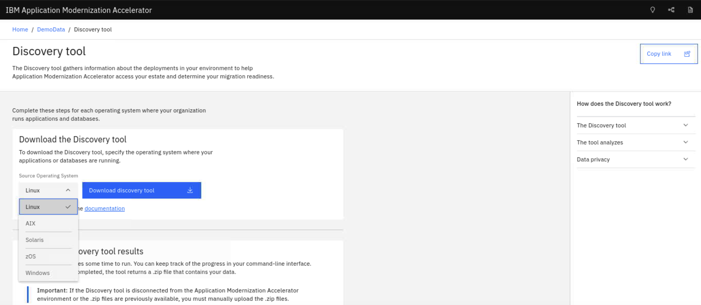

The discovery tool can be executed on any system that you want analyzed. It will discover all of your relevant Java application runtimes (such as IBM WebSphere Application Server), and their database and messaging dependencies. The tools will also discover details about any discovered Db2 database instances.

The result of the discovery is then automatically uploaded into Application Modernization Accelerator as a **Workspace**.

For the convenience of this lab, we have already run the discovery tool, and the results are stored in the **DemoData** workspace.

### Exploring discovery results

- From the main AMA panel, click on the workspace labelled **DemoData**. This will display a topology map from the **Visualization** tab.

    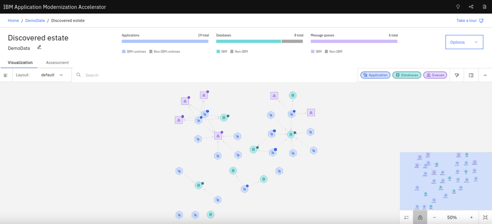

- The map includes all the applications, databases and message queues, and their relationships, which were discovered from the scanned systems.

    <div align="center">
    
    </div>

- You will see the total number and type of each node:

    <div align="center">
    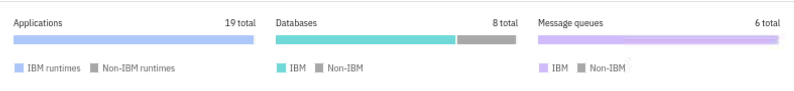
    </div>

- You will also see several features to help you pan and zoom on the map. Clicking on a specific node will bring up more details.

    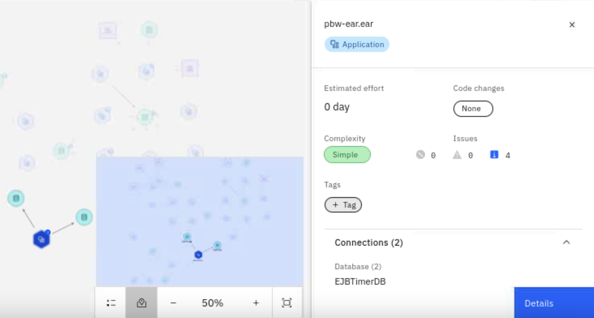

### Identifying potential capabilities to modernize

Each set of connected nodes can be thought of as a **workload** that can be modernized. Let's filter our map to show the `Acme` workload.

- Type **acme** in the field:

    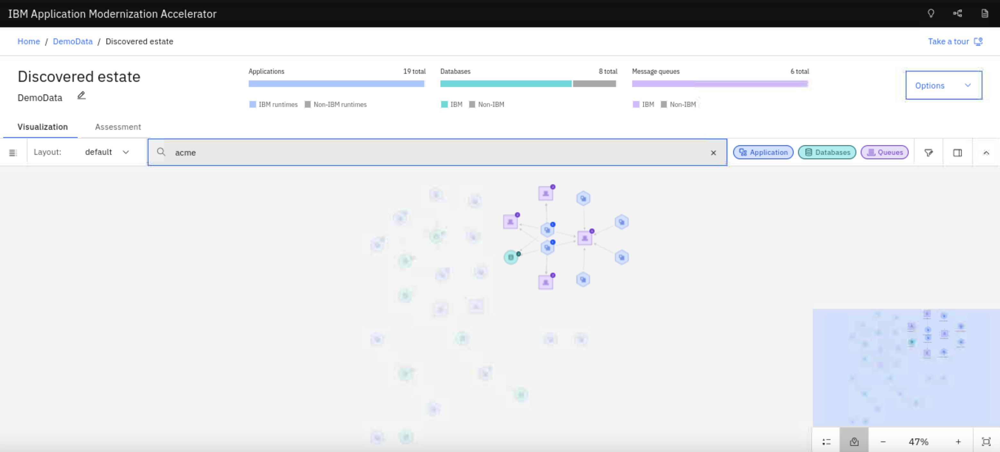

    Here you see all the nodes associated with the **Acme** workload. As you can see, this is a very complex system, with multiple applications using multiple message queues and databases. You can use the dependency information to help you to decide where to start with modernization. Further details to help with this decision are also available and will be seen later. 

For the purpose of this lab, we will work on a simpler workload. This is how you would typically start a modernization project. Starting simple helps you learn the tools and technologies.

- Replace the field with **mod**:

    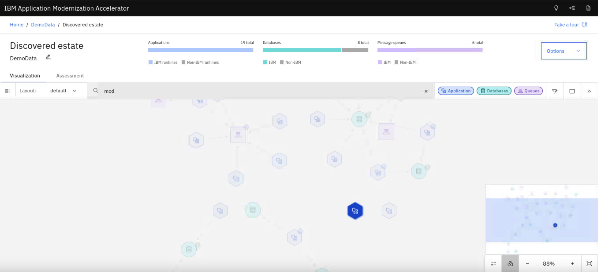

    Now you see only one node highlighted, which looks like a much better option to start with.

- Click on the application node (the blue hexagon) to see more details about ModResorts:

    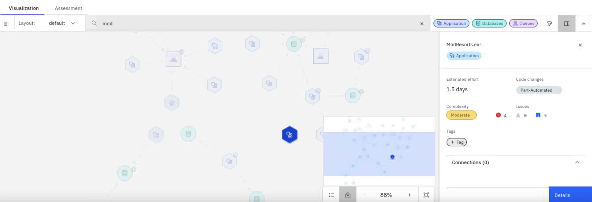

### Modernizing the ModResorts application

ModResorts appears to be a good candidate for modernization. Now let's explore this application in more detail.

- Click on the **Assessment** tab:

    

    Note that the **Enterprise Application Service** is automatically selected as the **Target destination**. This is the IBM Enterprise Application Service for Java managed service where we wish to build and deploy the application.

    As you can see, the overall total development cost for the whole workload is 22 days.

- Now let's focus on the ModResorts application. Scroll down and enter **modresorts** in the search bar to show the **ModResorts.ear** application:

    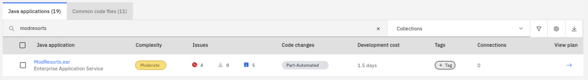

    Additionally, you will see:  
    - The application has a **Moderate** complexity rating, indicating that code changes are required for ModResorts to run on Enterprise Application Service.  
    - There are **4 Critical** issues and **5 Information** issues. Hovering over the issues reveals that Critical issues must be resolved, while Information issues are relevant for testing.  
    - The **Code Changes** column indicates that there is a **Part-Automated** method available to address the application's issues.

- Now click on the **ModResorts.ear** link to see the applications details page:

    

    This panel contains all the detailed information about this application. 

- Scroll down to the **Required code changes** section. Here, you will find the build configuration for executing OpenRewrite rules in a Maven or Gradle build. Since the application is marked as **Part-Automated**, some issues can be fixed automatically using these rules, while others require manual intervention. The same rewrite rules can also be applied within **watsonx Code Assistant**, which provides AI-assisted guidance for addressing the remaining issues (see **Modernizing the application to run on Enterprise Application Service for Java with watsonx Code Assistant** later in the lab).

    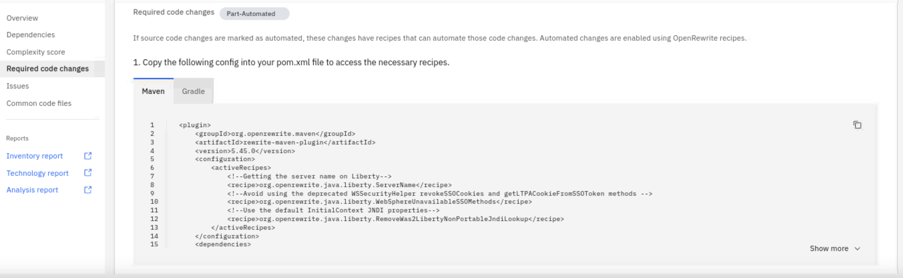

- Scroll down to the **Issues** section to review the required code changes for modernization.  

    Open the **Technology issues** accordion to view the **4 Critical issues**. Expand each issue to see detailed guidance. Note that three of these issues are marked with the automated-fix icon and can be resolved automatically by applying the provided configuration changes, while one requires manual intervention.

    [**NOTE**: You will address these issues later in the lab using **IBM watsonx Code Assistant**.]

    

- After reviewing the details of the ModResorts application, it remains a good candidate for modernizing to the Cloud. Key reasons include:

    - **Partially automated code changes**: Some required modifications can be handled automatically, reducing manual effort.

    - **No external dependencies**: The application operates independently, simplifying the migration process.

### Generating the migration plan

To start the migration, click the **View migration plan** button at the top of the panel.

- The Migration plan page contains all of the details about what will be included in your migration bundle:

    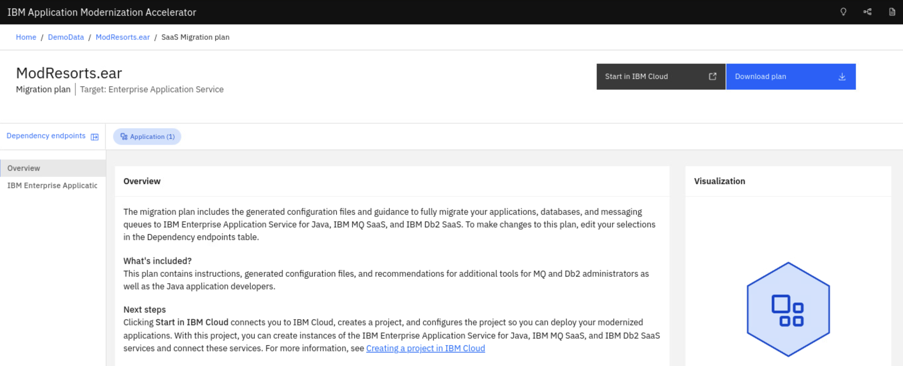

    Click through and read the contents of each section.

- At the right panel of the **IBM Enterprise Application Service** section you can see a preview of the files that are provided. Click on the `server.xml` file to get a preview:

    

    This is the starting configuration used to run the server and application locally during development and local testing.

- At the top left side of the panel, click the **Dependency endpoints** button:

    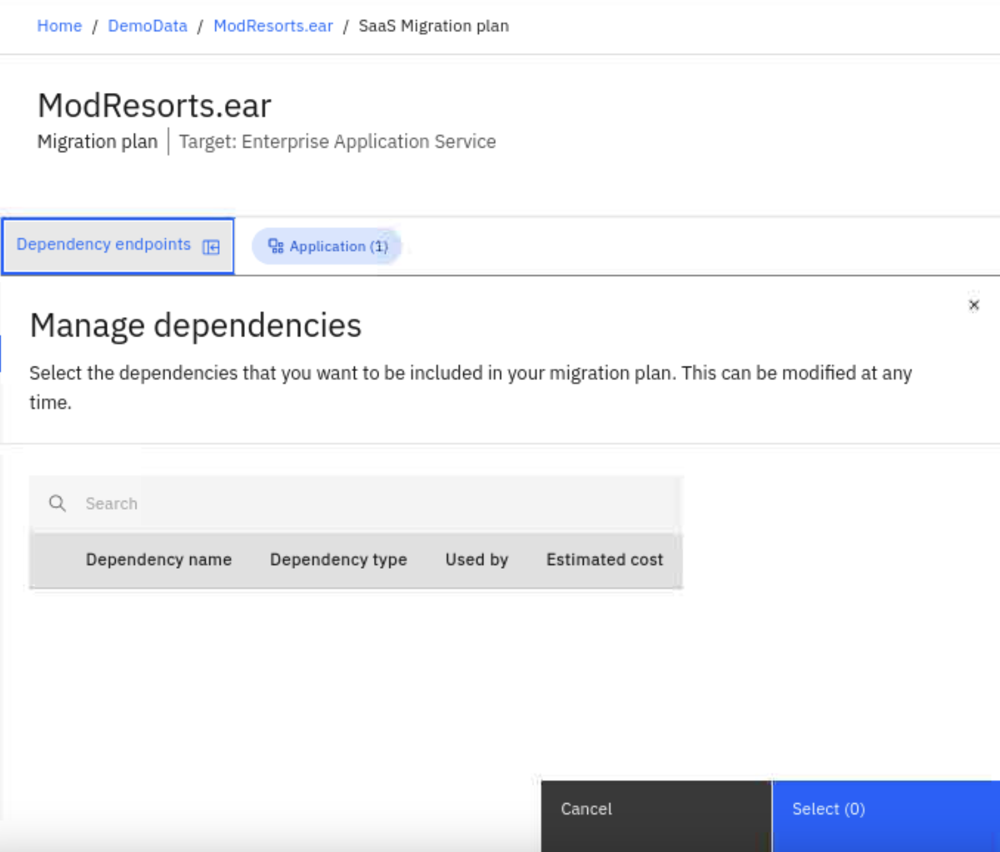

    This panel shows all the dependencies that are part of this migration plan. If you do not want to modernize any of the dependencies, or if they are no longer relevant, you can remove them from the plan by deselecting them.

    For this lab, there are no dependencies associated with the application.  

- Clicking the **Start in IBM Cloud** button creates a Cloud project, provisions service instances, and configures databases and message queues as outlined in the migration plan. From there you can customize the instances to suit your needs. However, this step will be skipped in this lab.

- At the top right side of the panel, click the **Download plan** button. This will result in a zip file being downloaded to your local system.

    

    You can explode this zip file bundle to see all the artifacts that AMA provides, including a **README** file that gives you step by step instructions on how to use the bundle. You will use this bundle in the next section of the lab.

## Step 2: Modernizing the application to run on Enterprise Application Service for Java with watsonx Code Assistant

Now, you'll update the ModResorts application from WebSphere Application Server to Liberty using **watsonx Code Assistant for Enterprise Java Applications**.

Originally, the application was developed using **traditional WebSphere Application Server** code. With **watsonx Code Assistant for Enterprise Java Applications**, you can leverage an AI-powered feature to modernize the application to the latest **WebSphere Liberty Server**.

### Cloning the ModResorts GitHub repository

In a terminal, clone the ModResorts repository from GitHub:
   
```bash
cd /home/admin
git clone https://github.com/IBM/sample-app-mod.git
cd sample-app-mod
```

### Opening the project in VS Code

- Launch the **VS Code IDE** from your system.

- Navigate to **File** > **Open Folder...**, then select the `sample-app-mod` folder from your local directory. 
   
   When the project opens, ensure the **Welcome view** remains open. This allows the **watsonx Code Assitant** features to open in a new pane beside your editor for seamless coding.

### Logging into watsonx Code Assistant

To access **watsonx Code Assistant for Enterprise Java Applications**, you need to log in using an **IBM watsonx Code Assistant API key**. 

- Click the **watsonx Code Assistant** icon  in the IDE's side panel, then enter your API key. 

- Once logged in, a greeting message will appear in the chat panel.

    <div align="center">
    
    </div>

### Starting the modernization process

- In the **Explorer** pane, right-click on either an empty area within the project folder or any file in the project. From the context menu,  select **watsonx Code Assistant** → **Modernize to Liberty**.

    <div align="center">
      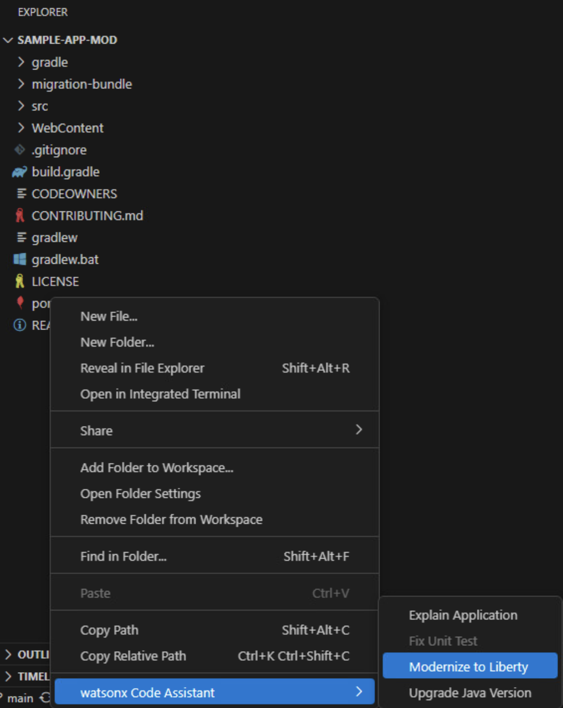
    </div>

- The **Modernize to Liberty** interface will open.

### Selecting a modernization method

The tool offers two methods for modernizing your application:

1. **Using a migration bundle:**

   Use an [IBM Cloud® Transformation Advisor](https://www.ibm.com/docs/en/cta?topic=about-transformation-advisor) migration bundle to modernize your application. The migration bundle includes a list of modernization issues that need to be addressed and contains automatically generated configuration information to help the application function properly in Liberty. This is the recommended approach, as the bundle captures important configuration details from the environment where the Java application was running.

2. **Analyzing the application:** 
  
   If a migration bundle is not available, you can analyze your application directly. This analysis provides a list of issues to address but does not include configuration information because the application server environment isn’t analyzed. For complete modernization, a Transformation Advisor migration bundle is required to assess the application server environment.

In this lab, you will use the migration bundle option.

- On the **Modernize ModResorts** page, click **Upload migration bundle**.

    <div align="center">
      
    </div>

- Locate and select the `modresorts.ear_migrationBundle.zip` file from the `migration-bundle` folder in the project directory. The file path is [`sample-app-mod-v1\migration-bundle\modresorts.ear_migrationBundle.zip`](https://github.com/IBM/sample-app-mod/blob/main/migration-bundle/modresorts.ear_migrationBundle.zip).

- Click **Open** to upload the bundle.

### Extracting configuration files

Once the migration bundle is uploaded, watsonx Code Assistant for Enterprise Java Applications will extract the following key configuration files:

- `server.xml`: Defines the application's configuration.

- `Containerfile`: Can be used to build a Liberty image.

Review the extracted files, then check the selection box and click **Proceed** to add them to the project.

<div align="center">
  
</div>

### Reviewing and auto-fixing detected issues

Once the **Modernize ModResorts** page opens, it will display issues detected by watsonx Code Assistant for Enterprise Java Applications. These issues may require automated fixes, assisted fixes, or manual adjustments. Additionally, the **Additional information** tab highlights issues you should be aware of when migrating your application, though these do not require code changes.

To resolve issues that can be fixed automatically:

- Navigate to the **Automated fixes** tab.

- Click the **Run automated fixes** button.

  <div align="center">
    
  </div>

> **NOTE**: If the **Back to top** button blocks your view, you can drag it to a different spot on the screen.

### Resolving assisted fixes

Assisted fixes are issues where watsonx Code Assistant for Enterprise Java Applications provides guidance and code suggestions to help you resolve them.

- Open the **Assisted fixes** tab.

  <div align="center">
    
  </div>

- Expand each issue to view its details.
  <div align="center">
    
  </div>

- Use the caret icon next to the file name to reveal step-by-step instructions for resolving the issue.

  <div align="center">
    
  </div>

- watsonx Code Assistant for Enterprise Java Applications will outline the steps to fix the issue. Carefully review these steps and click the file name to open it in the editor.

  <div align="center">
    
  </div>

**Resolving the issue "The WebSphere Servlet API was superseded by a newer implementation"**

 - Navigate to the file `src/main/java/com/acme/modres/UpperServlet.java` as indicated in the issue details.

- Highlight the `doGet()` method (lines 19 to 33) or the entire class as specified in the instructions.

- Click the **Help me** button in the issue resolution interface.

  <div align="center">
    
  </div>

- watsonx Code Assistant will generate a suggested solution in the chat window, including updated code for the highlighted section.

- Review the suggested solution. Use the copy button  next to the suggested code blocks to copy the code to your clipboard.

  - **Handling import statements**: Depending on your code selection (e.g. selecting the `doGet` method versus selecting the entire class), the code suggestion that you get may vary. Review the code suggestion and copy the relevant code from the chat to your editor. If import statements were generated, place them at the top of the class appropriately.

    <div align="center">
      
    </div>

  - **Updating build dependencies**: watsonx Code Assistant should provide a code block with additional dependency instructions. Copy this dependency block, navigate to the `pom.xml` file in your `sample-app-mod-v1` project folder, and add it within the `<dependencies>` block.

    <div align="center">
      
    </div>

- Review the suggested solution and make adjustments to the code as needed.

  Keep in mind that these are **assisted suggestions** and may not provide a complete solution. If needed, ask follow-up questions in the chat for further clarification or guidance.

### Verifying changes

- After applying the changes, save the file.

- Click the **Rebuild and refresh** button to verify the updates.

  <div align="center">
    
  </div>

### Finalizing the migration

You can now verify that the migration process is complete by following these steps:

- To deploy the application on Liberty, you need to enable the [Liberty Maven plug-in](https://github.com/OpenLiberty/ci.maven) in your project. Add the Liberty Maven plug-in to the `<plugins>` section within the `<build>` block of your `pom.xml` file:

  ```xml
  <plugin>
      <groupId>io.openliberty.tools</groupId>
      <artifactId>liberty-maven-plugin</artifactId>
      <version>3.11.2</version>
  </plugin>
  ```

- Open a terminal in VS Code, ensure it is located at the your `sample-app-mod` project directory, and start the application in Liberty dev mode:

  ```bash
  mvn liberty:dev
  ```

  Dev mode provides an interactive development experience, allowing you to make changes to your application or configuration while automatically updating the application for immediate feedback. You can also press **Enter** to run application test cases.

- Once the server starts, visit http://localhost:9080/resorts in your browser. You should see the application’s homepage.

- After you are finished checking out the application, stop the Liberty instance by pressing **CTRL+C** in the command-line session where you ran Liberty. 

## Step 3: Deploy application to cloud using IBM Enterprise Application Service for Java

Now that we have modernized our ModResorts application to use the Java **Liberty Runtime**, we can build and deploy it in Enterprise Application Service for Java.

Provide the instructor with your email address associated with your GitHub account. You will then be assigned a student number that you can use throughout this section of the lab.

For convenience, each student will be given authorization to access the following:

- GitHub Organization - **techxchange2024**
- GitHub **source** repo - **student-source-{number}**
- GitHub **config** repo - **student-config-{number}**
- IBM SaaS account - **techxchange2024-saas**
- IBM Enterprise Application Service subscription - **Application Flow**
- IBM Enterprise Application Service service instance - **student-{number}**

>**NOTE**: To save time and eliminate any mistakes made in the previous step, the **source** repository already contains the ModResorts app with the changes applied to run on Liberty.

>**IMPORTANT**: You will receive an email regarding access to the **techxchange2024** GitHub Organization. You must accept the invitation in order to complete this section of the lab.

### Access your Enterprise Application Service service instance

1. Use this link to start:

    https://ibm-cloud.console.saas.ibm.com

    <div align="center">
        
    </div>

    Click on the **techxchange2024-saas** tile to view the account details.

1. Click the **View instances** link to bring up the **Instance** list.

    <div align="center">
        
    </div>

1. Select your instance (it should be the only one with a clickable link).

    <div align="center">
        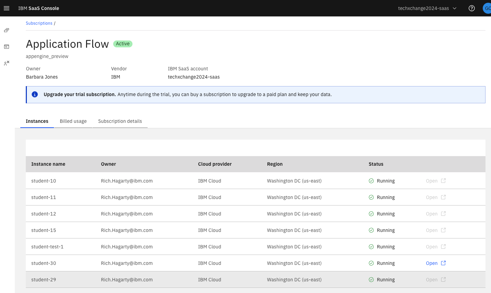
    </div>

    From the list of instances, **Open** the instance associated with your student number.

### Configure GitHub repos for your Enterprise Application Service service instance

1. Since no GitHub repos have been configured to your service instance, you will need to do this now. This step enables updates to the source repo to trigger builds, and updates to the config repo to trigger deployments in Enterprise Application Service for Java. You will see the following panel:

    <div align="center">
        
    </div>

    Click **Install and configure** to continue.

    <div align="center">
        
    </div>

    Click the **Build, Deploy & Run** option. (Note, the Deploy & Run option allows you to build your application in an existing CI pipeline and deploy it with Enterprise Application Service for Java).

    This will start a series of steps for you to setup and authorize access to your GitHub account and your application repos (**source** and **config**).

    Click `Next`.

1. Authorize access to GitHub.
   
    <div align="center">
        
    </div>

    Click **Authorize access to GitHub** and enter your GitHub account information. 
    
    <div align="center">
        
    </div>
       
    Once authorized, click **Next**.

    <div align="center">
        
    </div>

1. Select an organization

    <div align="center">
        
    </div>

    Select the **techxchange2024** organization and click **Next**.

    >**NOTE**: To use Enterprise Application Service, all GitHub repos must be assigned to a GitHub Organization.

1. Assign GitHub source and config repos

    Select your student assigned source GitHub repository and click **Next**.

    <div align="center">
        
    </div>

    Select your student assigned configuration GitHub repository and click **Next**.

    <div align="center">
        
    </div>

1. Confirm GitHub settings

    <div align="center">
        
    </div>

    Confirm your settings and click **Finish**.

1. Navigate the Enterprise Application Service console

    Once confirmed, you will see the Enterprise Application Service console.

    <div align="center">
        
    </div>

    Use the icon in the upper left to show the menu options.

    <div align="center">
        
    </div>

    Note that the **Builds** menu options are related to your **source** code repo, and the **Configuration jobs** menu options are related to your **config** repo.

### Enterprise Application Service GitHub flow

Once you configured your source repo, a **Release build** was automatically started.

1. From the menu, select **Builds** -> **Release builds**.

    <div align="center">
        
    </div>

    Click the **Build ID** to bring up the **Build details**.

    <div align="center">
        
    </div>

    If successful, you will see a **Deploy to staging** button. Click the button to get instructions on how to deploy your application.

    <div align="center">
        
    </div>

    In order to deploy, you will need to update the associated **config** repo, using the **Version ID** value displayed on the instructions page.

1. Update staging config file with Release build version ID
   
    Using the editor directly in your GitHub config repo, edit the environments/staging/environment.yaml file.

    Paste the ID as the version key value. [Note: keep the double quotes]

    <div align="center">
        
    </div>

    After editing the file, click the **Commit changes...** button.

    In the **Propose changes** panel, make sure you select to **Create a new branch** option.

    <div align="center">
        
    </div>

    Click **Propose changes** then click the button to create a Pull Request.

    Creating the Pull Request will trigger Enterprise Application Service to run **Configuration validation** job. This can be viewed by selecting the **Configuration jobs** -> **Configuration validations** menu option.

    <div align="center">
        
    </div>

    Your GitHub PR panel will show that it is in a **Checks** phase until the validation check is complete. 

### Promote to staging environment and run application

Once the validation has completed successfully, merge the Pull Request into the **Main** branch of your repo.
    
Note: using Pull Requests is the recommended workflow.  This means you can have a peer review the changes and make the decision on whether they are correct and ready to merge.  Enterprise Application Service also has the same option for code changes.  Creating a Pull Request for code changes will trigger a Pull Request build where you can validate that the application builds and passes the tests (not just locally!). Merging the Pull Request triggers Enterprise Application Service to run a Release build, which we saw happen when the source repository was first configured. 

The PR merge will trigger Enterprise Application Service to run a **Deployment job** to deploy the Release into a Staging environment. The progress can be viewed by selecting the **Configuration jobs** -> **Deployments** menu option. [Note that this step may take a few minutes].

<div align="center">
        
    </div>

Upon succesful completion of the **Deployment**, Enterprise Application Service will automatically start the application in the **Staging** environment.

1. Click **Environments** -> **Staging** to view the Staging environment.

    <div align="center">
        
    </div>

    Note that the **Release build** link should take you to the release build that was deployed to Staging, and the **Deployment job** link will take you to the deployment job that deployed the release to Staging.

    At the bottom of the panel is a build log. For our ModResorts app, you can see here that it was successfully started:

    <div align="center">
        
    </div>

1. To view the running application, click on **Actions** -> **Open application**.

    Initially, you will get a `404` error because a context path must be provided.

    Add **/resorts** to the end of the URL to provide the proper path.

    <div align="center">
        
    </div>

### Modify application source code

Now that you know how the process works, let's make a change to the source repo to see that part of the workflow.

1. Using the editor directly in your GitHub **source** repo, make a simple change to the **README.md** file. 

    After editing the file, click the **Commit changes...** button.

    In the **Propose changes** panel, make sure you select to **Create a new branch** option.

    <div align="center">
        
    </div>

    Then click the button to create a **Pull Request**.

2. This will trigger a **PR build** in Enterprise Application Service. This can be viewed by selecting the **Builds** -> **PR builds** menu option.  

    <div align="center">
        
    </div>

    Your GitHub PR panel will show that it is in a **Checks** phase until the PR build is complete. 

    <div align="center">
        
    </div>

    Once the PR build is complete, merge and confirm your pull request into the Main branch of your repo.

3. The PR merge will generate a **Release build** event in the EASeJ console. This can be viewed by selecting the **Builds** -> **Release builds** menu option.

    <div align="center">
        
    </div>

    Click on the **Build ID** number to bring up details on the build.

    <div align="center">
        
    </div>

    Once completed, it will display a status label to indicate if it **Succeeded** or **Failed**.

    If errors occurred, the **Build log** can help you track the issue.

    Click on the **Downloads** tab to see the assets generated by the build. You will see that one of the files is a SLSA provenance json.  This provides information about the artefacts and build system used for the application and is useful to help protect against supply chain security exploitation attacks.

    <div align="center">
        
    </div>

### Deploy the new version of the app

Once the application changes have been merged and built, we need to update the Staging **config** to deploy the new release.

The steps required will follow the same flow as described above.

>**NOTE**: **[Service]** and **[GitHub]** indicates which UI you will be using to perform the step, where **[Service]** is the Enterprise Application Service console and **[GitHub]** is the GitHub UI.

1. **[Service]** Click the **Deploy to staging** button.
   
2. **[Service]** Copy the **Version ID** value.
   
3. **[GitHub]** Edit the **environments/staging/environment.yaml** file in your GitHub **config** repo.
   
4. **[GitHub]** Paste the ID as the **version** key value. [Note: keep the double quotes]
   
5. **[GitHub]** Commit the change using the **Create a new branch** option.
   
6. **[GitHub]** Click the button to create a **Pull Request**.
   
7. **[Service]** The pull request will trigger a **Config validation** job. View the validation by selecting the **Configuration jobs** -> **Configuration validations** menu option.
   
8. **[GitHub]** Once complete, merge and confirm your Pull Request into the Main branch of your GitHub **config** repo.
   
9. **[Service]** Merging the Pull Request will trigger a **Deployment**. View the deployment by selecting the **Configuration jobs** -> **Deployments** menu option.
    
10. **[Service]** After successful completion of the **Deployment**,  Enterprise Application Service will automatically start the application in the **Staging** environment.
    
11. **[Service]** Click **Environments** -> **Staging** to view the staging environment.
    
12. **[Service]** Click on **Actions** -> **Open application** to view the application. [Don't forget to add the **/resorts** context to the URL]


---

# Troubleshooting

This section provides guidance on troubleshooting common issues during the lab.

## Installing WebSphere Application Server dependencies

The ModResorts application requires dependencies from WebSphere Application Server (WAS) APIs version 9.0.0 to build and run successfully. The required module JAR file `was_public.jar` and its associated `pom` file are provided in the `/home/admin/was-dependency` directory. These dependencies are pre-installed in the local Maven repository in the VM.

If you need to reinstall them, you can run the following command:

  ```bash
  mvn install:install-file -Dfile=/home/admin/was-dependency/was_public.jar -DpomFile=/home/admin/was-dependency/was_public-9.0.0.pom
  ```
